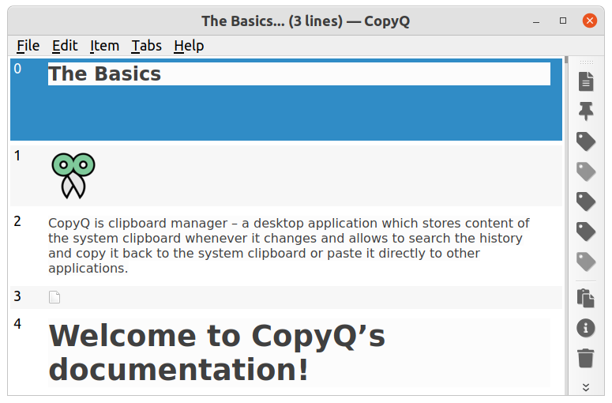
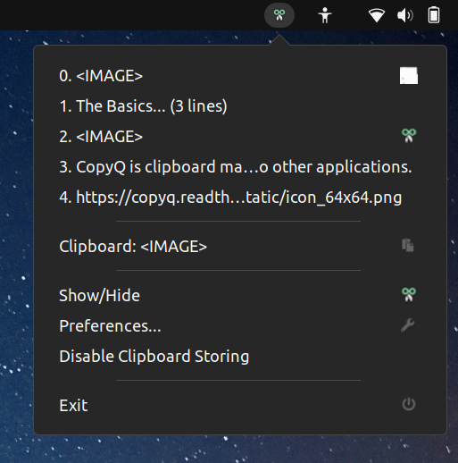

Basic Usage
===========

This page describes the basic functionality of CopyQ clipboard manager.

First Start
-----------

To start CopyQ, double-click the program icon or run command ``copyq``.
This starts the graphical interface which can be accessed from the tray (NOTE: on OS X the tray defaults to the top-right of the screen and is not to be confused with Launchpad).
Click the tray icon to show application window or right-click the tray icon and select "Show/Hide" or run ``copyq show`` command.

  
The central element in the application window is **item list** containing
**clipboard history**. By default, the application **stores any new clipboard
content** in the list.

If you copy some text it will immediately show at the top of the list.
Try copying text or images from various application to see how this works.

.. seealso::

        :ref:`faq-disable-clipboard-storing`

Basic Item Manipulation
-----------------------

In the item list, press ``F2`` to **edit selected text items**.
After editing, press ``F2`` again to **save the text**.

Create **new item** with ``Ctrl+N``, type some text and press ``F2`` to save
the new item.

**Copy the selected items** back to clipboard with Enter key or ``Ctrl+C``.

**Move items** around with ``Ctrl+Down`` and ``Ctrl+Up``.

You can move important or special items to new tabs (see
:ref:`tabs` for more info).

Search
------

In the list you can **filter items by typing some text**.

For example, typing "Example" hides items that don't contain
"Example" text. Press Enter key to copy the first found item.

Tray
----

To quickly copy item to clipboard, you can select the item from tray
menu. To display the menu either right-click on tray icon, run command
``copyq menu`` or use a custom system shortcut.

After selecting an item in tray menu and pressing enter (pressing a
number key works as well), the item is copied to the clipboard.

.. seealso::

    :ref:`faq-show-app`

    :ref:`faq-paste-from-window`
