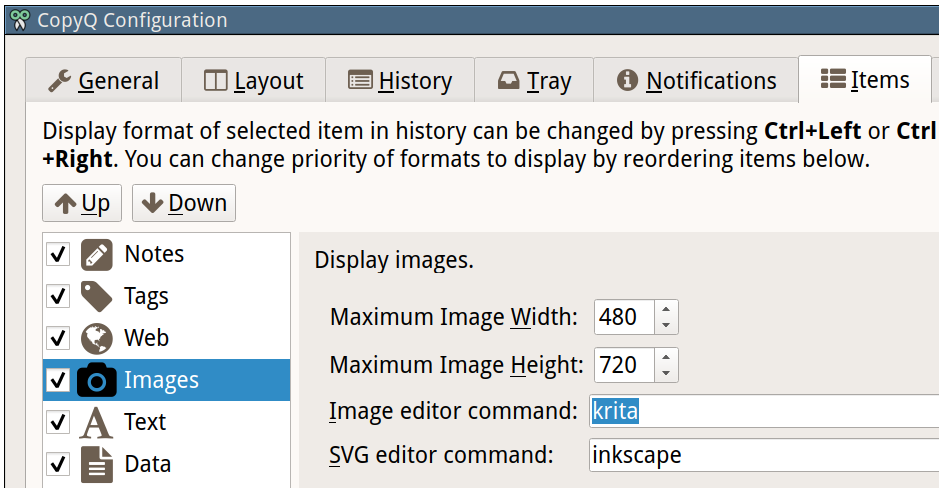

Images
======

This page describes how to display and work with images in CopyQ.

Display Image Items
-------------------

Displaying images can be configured in "Items" configuration tab.

On Windows, "Item Image" plugin needs to be installed.

To disable storing and displaying image, disable the Image plugin
(uncheck the checkbox next to "Image" in configuration).

Editor
------

Editors for bitmap and SVG images can be set in the configuration.

Editing an image item (default shortcut is Ctrl+E) should open the image
editor.

Unfortunately, sometimes an item looks like an image but is an HTML. You
can list available formats in Content dialog F4.

Preview Image
-------------

It's useful to limit size of image item to a maximum width and height in
the configuration.

You can still display the whole image in Preview dock (F7) or using
Content dialog (F4).

Take Screenshots
----------------

You can use built-in functionality for `taking
screenshots <https://github.com/hluk/copyq-commands/tree/master/Global#screenshot>`__
of whole or part of the desktop.

Paste taken screenshots to CopyQ to store them for later use.

Save Image to a File
--------------------

To save an image to a file, either copy it or drag'n'drop it to a file
manager (if supported) or save it using command line.

.. code-block:: bash

    copyq read image/png 0 > image.png

Alternatively use `"Save Item/Clipboard To a File"
command <https://github.com/hluk/copyq-commands/tree/master/Application#save-itemclipboard-to-a-file>`__.
