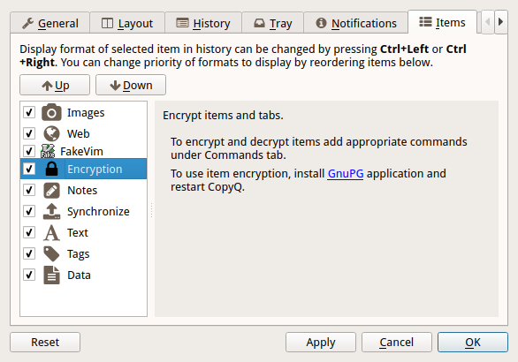
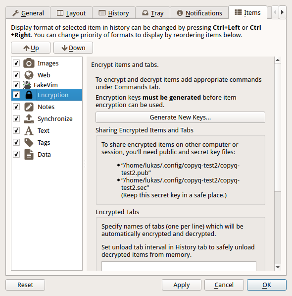
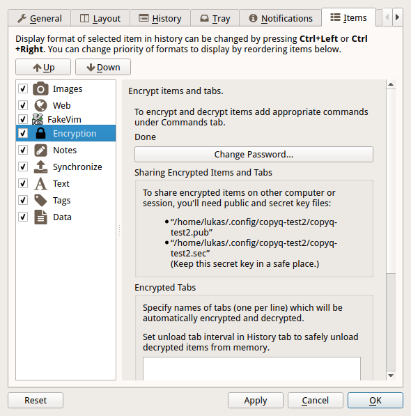
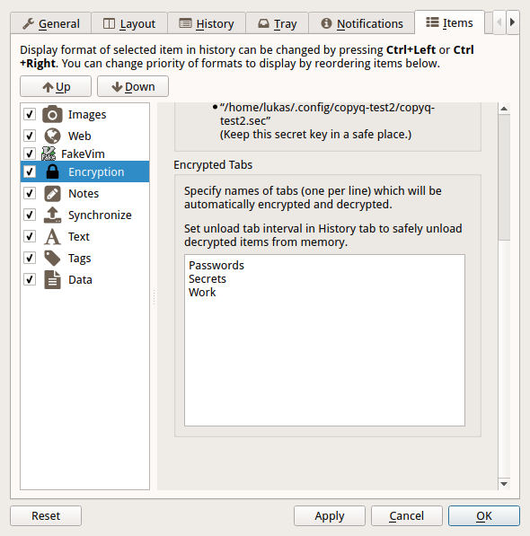
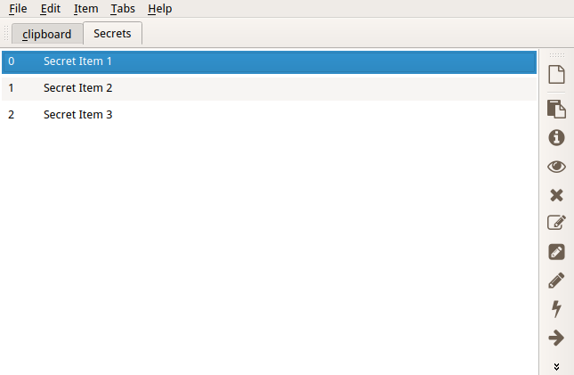
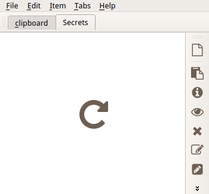

.. _encrypt:

Password Protection
===================

This page describes how to encrypt and protect selected tabs and single
items with a password.

Installation
------------

To enable this feature you need to have "Encryption" item plugin.

The plugin configuration (under "Items" configuration tab in
Configuration dialog) may prompt you to install
`GnuPG <http://www.gnupg.org/>`__:

-  For Windows you can use `Chocolatey <https://chocolatey.org/install>`__ to
   install `Gpg4win <https://chocolatey.org/packages/gpg4win>`__::

       choco install gpg4win

-  For Linux install ``gpg`` command line utility. It's usually provided
   by ``gnupg`` package but the package name may differ on some
   distributions.

Generate Keys and Set Password
------------------------------

To be able to encrypt tabs and items you first need to generate private
and public key files.

Click on the "Generate Ney Keys..." button and wait.

If didn't set a password in previous step click "Change Password..."
button and set it.

Last step in configuration is to set tabs to encrypt. You can skip this
step if you only need to encrypt single item in each tab (see next
section).

Click "OK" button to confirm Configuration dialog.

Protect Tabs
------------

Now you can create the tabs you want to encrypt (Ctrl+T to create new
tab).

The tab name should be same as one of the tabs entered in plugin
configuration in previous step.

You'll be prompt to enter password in future (you only need to enter it
once in a while).

If you enter wrong password or cancel the password prompt you can later
click on "Reload" button in tab to enter password again.

Protect Single Items
--------------------

To protect items in unprotected tab you can add menu and tool bar
actions with keyboard shortcut.

Go to Command dialog F6, click on "Add" button, "Encryption" commands
from list and confirm dialogs with "OK" button.

Now you can select items and press Ctrl+L to encrypt ("Items -
Encryption - Encrypt" in menu).

To decrypt selected item press Ctrl+L ("Items - Encryption - Decrypt" in
menu).
