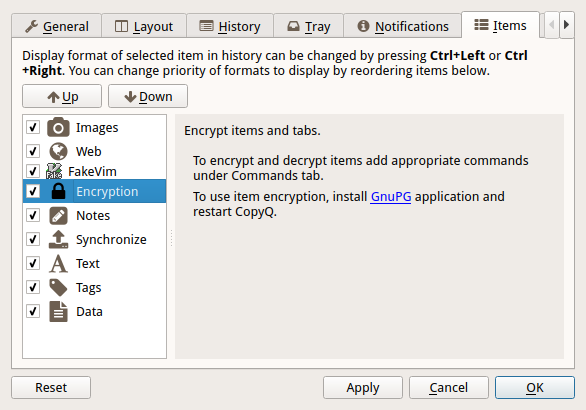
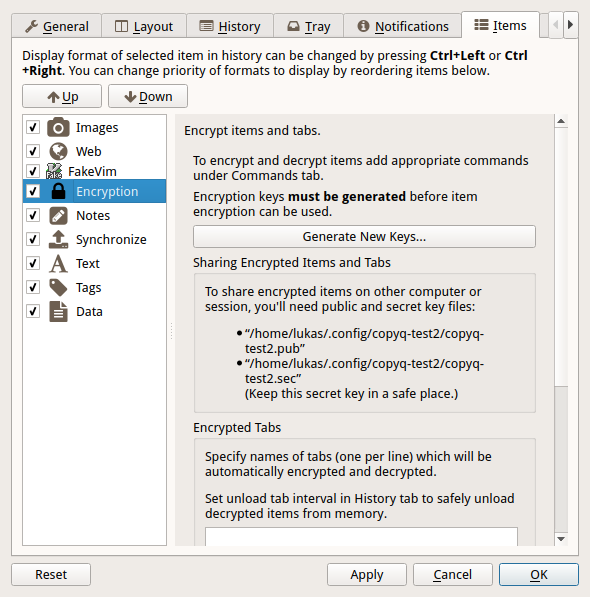
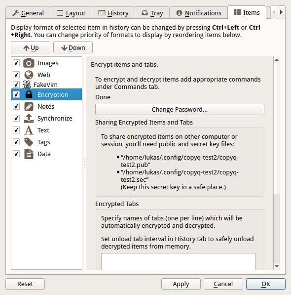
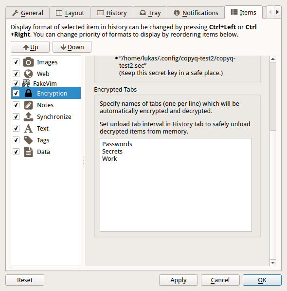
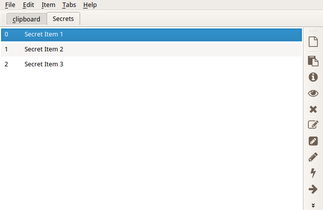
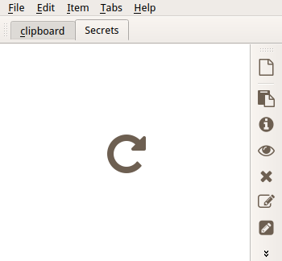

.. _encrypt:

Password Protection
===================

This page describes how to encrypt clipboard data stored by CopyQ. The
recommended approach is the built-in encryption available since version 14.0.0.
A legacy plugin using GnuPG is also documented below for older versions or
per-item encryption needs.

Built-in Encryption
-------------------

CopyQ can encrypt all stored tab data with a user-set password. No external
software is required.

To enable it, open **Preferences** and check the **Encrypt Tabs** option.
You will be prompted to set a password. The password is needed when CopyQ
starts and when changing the encryption password. If **Require password after
an interval** is enabled (in the "History" configuration tab), the password is
also requested periodically.

To avoid entering the password at startup, enable **Use external key store**.
This delegates password storage to a platform key store (note that this does
not bypass the periodic prompt when password expiry is enabled):

- **Windows** — Credential Store
- **macOS** — Keychain
- **Linux** — GNOME Keyring or KWallet

Unlike the legacy Encryption plugin, built-in encryption automatically covers
all tabs loaded by the application — there is no per-tab or per-item setup.

.. note::

   Built-in encryption protects data at rest but does **not** encrypt exported
   data. The ``exportTab`` and ``exportData`` script commands always write
   unencrypted files. When exporting from the GUI (**File — Export**), CopyQ
   prompts for an optional export password — if provided, tab data in the
   export file is encrypted with that password. See :ref:`backup` for details.

Encryption Plugin (Legacy)
--------------------------

.. deprecated:: 14.0.0
   The Encryption plugin is obsolete. Use the built-in encryption described
   above instead. The plugin remains available for users who need per-item
   encryption or are running CopyQ versions older than 14.0.0.

.. warning::

   The plugin depends on GnuPG (``gpg2``), which introduces external key
   management complexity and version-compatibility issues. The password must
   be re-entered every few minutes.

Installation
~~~~~~~~~~~~

To enable this feature you need to have "Encryption" item plugin.

The plugin configuration (under "Items" configuration tab in
Configuration dialog) may prompt you to install
`GnuPG <http://www.gnupg.org/>`__:

-  For Windows you can use `Chocolatey <https://chocolatey.org/install>`__ to
   install `Gpg4win <https://chocolatey.org/packages/gpg4win>`__::

       choco install gpg4win

-  For Linux install ``gpg`` command line utility. It's usually provided
   by ``gnupg`` package but the package name may differ on some
   distributions.

Generate Keys and Set Password
~~~~~~~~~~~~~~~~~~~~~~~~~~~~~~

To be able to encrypt tabs and items you first need to generate private
and public key files.

Click on the "Generate Ney Keys..." button and wait.

If didn't set a password in previous step click "Change Password..."
button and set it.

Last step in configuration is to set tabs to encrypt. You can skip this
step if you only need to encrypt single item in each tab (see next
section).

Click "OK" button to confirm Configuration dialog.

Protect Tabs
~~~~~~~~~~~~

Now you can create the tabs you want to encrypt (Ctrl+T to create new
tab).

The tab name should be same as one of the tabs entered in plugin
configuration in previous step.

You'll be prompt to enter password in future (you only need to enter it
once in a while).

If you enter wrong password or cancel the password prompt you can later
click on "Reload" button in tab to enter password again.

Protect Single Items
~~~~~~~~~~~~~~~~~~~~

To protect items in unprotected tab you can add menu and tool bar
actions with keyboard shortcut.

Go to Command dialog F6, click on "Add" button, "Encryption" commands
from list and confirm dialogs with "OK" button.

Now you can select items and press Ctrl+L to encrypt ("Items -
Encryption - Encrypt" in menu).

To decrypt selected item press Ctrl+L ("Items - Encryption - Decrypt" in
menu).
