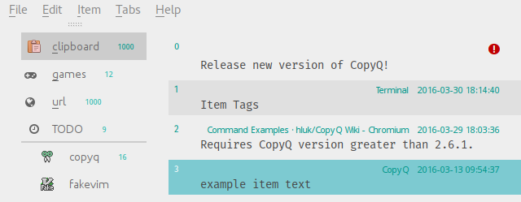
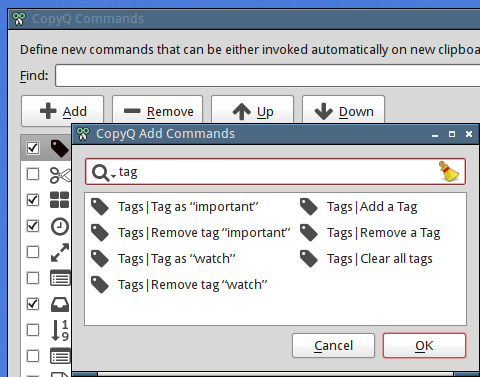

Tags
====

Tags are small icons or short texts in upper right corner of an item
used to mark important or special items.

Tags can be configured in "Items" configuration tab. On Windows, "Item
Tags" plugin needs to be installed.

.. image:: images/tags-config.png

Configuration consists solely of table where each row contains matching
and styling rules for tags.

Style from the first row which matches tag text is applied on the tag.

Column in the table are following.

-  "Tag Name"

Text for the tag. This is used for matching if "Match" column is empty.
Expressions like ``\1``, ``\2`` etc. will be replaced with
captured texts from "Match" column.

-  "Match"

Regular expression for matching the tags.

E.g. ``.*`` (any tag), ``Important: .*`` (match prefix),
``\d\d\d\d-\d\d-\d\d.*`` (date time).

-  "Style Sheet"

Simple style sheet (https://doc.qt.io/qt-5/stylesheet-reference.html).

E.g. ``border: 1px solid white; border-radius: 3px; font-size: 7pt``.

-  "Color" - Text color.

-  "Icon" - Icon for tag. To show only icon without text you have to set
   "Match" and keep "Tag Name" field empty.

-  "Lock" - If enabled, items with such tag will have to be untagged before
   deleting.

Tagging items can be accessed from context menu if appropriate commands
are added in Command dialog (generated commands are available in the
list under "Add" button).

Alternatively, tags are added to an item by setting
"application/x-copyq-tags" format. It can contain multiple tags
separated by comma. The tag text itself can be written as simple HTML.

Example:

::

    copyq write text/plain "Item with tag" application/x-copyq-tags "Some tag text"
